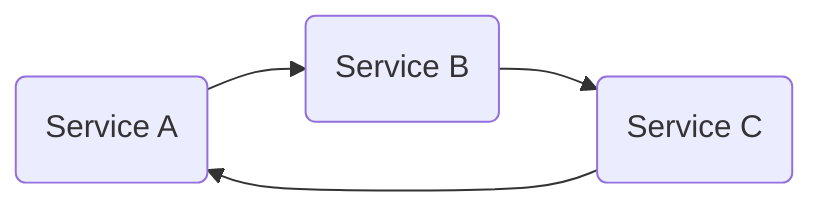

# A thought on leetcode
A horrendous bug was discovered at work today. How horrendous? It had to do with concurrency. The bug came as a side effect from a cycle in our service API bug detection program. Our program ran by recursively following the verdict result from failing services. After some debugging, essentially:

Immediately a task was issued to implement a fix to detect the cyclic verdict mechanism which was trapping our program. This is a simple problem, once one is able to frame the problem as a cyclic detection problem, it devolves to [a leetcode easy](https://leetcode.com/problems/linked-list-cycle/). The widely accepted optimal solution which uses O(1) space is [Floyd's tortoise and hare](https://en.wikipedia.org/wiki/Cycle_detection#Floyd's_tortoise_and_hare)two pointer solution. In our case, to implement such a solution would mean establishing an additional runner to complete the loop, finding a cycle only after a minimum of 1 full additional cycle has been made. This would not have made the most sense, as this meant making additional requests to our verdict endpoint, increasing the overall latency to determine this rare cyclic case. Our go-to solution became the naïve method of storing visited nodes in a HashMap, and checking against it before continuing down our call sequence.

Algorithms knowledge provides the programmer with options. The solution to a real-world issue may not be the same algorithm used in a leetcode problem, but the ability to frame the problem, and have the knowledge of different potential solutions and their trade-offs is an essential everyday skill.