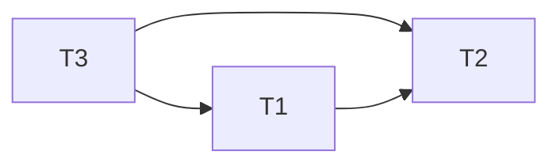

# Concurrency Control
The DBMS needs to ensure consistency during concurrent execution of transactions, as concurrency can result in the database being in an inconsistent state despite preserving the correctness of transactions and without encountering a failure.
## Scheduler
A schedule is a sequence of interleaved actions from all transactions.
### Serial schedule
A schedule is serial if its actions consists of all the actions of one transaction, then all the actions of another transaction, and so on.

### Serializable schedule 
Result is equivalent to a serial schedule, but actions of one transaction do not have to occur before the actions of another.

### Conflict Serializable Schedule

If a pair of actions conflict, if their order is interchanged, the behavior of at least one of the transactions can change.
From this we can draw 2 conclusions about when a pair can be swapped.
1. Actions involve the same element
2. At least one is a write

#### Precedence Graph
We can use a precedence graph to determine if a set of transactions are conflict serializable. An edge from one node to another represents a constraint on the order of the transactions. i.e. Actions in a transaction t1 cannot be swapped with another transaction t2. If a cycle occurs, the order of transactions become contradictory and no serial schedule can exist.

### Recoverable Schedule
A schedule is recoverable if transactions commit only after all transactions whose changes they read have committed.
Else, the DBMS is unable to guarantee that transactions read data that will be the same as before the crash and after the crash.

## Locks
Ensure that data items that are shared by conflicting operations are accessed one operation at a time. Same as with [Process Synchronization](Notes/Process%20Synchronization.md). 

### Two Phase Locking (2PL)
Arbitrary assignment of locks do not lead to a serializable schedule. Two transactions can operate on elements in a different order resulting in different results. We can solve this by ensuring that transactions take up all lock actions before all unlock actions.

#### Why 2PL works?
Intuitively, each two-phase-locked transaction may be thought to execute in  its entirety at the instant it issues its first unlock request. i.e. a legal schedule can only be such that the transaction completes fully, because otherwise, this means that another transaction is attempting to take a held lock, causing a deadlock. Hence, there is at least one conflict-serialisable schedule: the one in which the transactions appear in the same order as first unlocks.

Suppose the schedule starts with T1 locking and reading _A_. If T2 locks _B_ before T1 reaches its unlocking phase, then there is a deadlock, and the schedule cannot complete. Thus, if T1 performs an action first, it must perform _all_ its actions before T2 performs any. Likewise, if T2 starts first, it must complete before T1 starts, or there is a deadlock. Thus, only the two serial schedules of these transactions are legal.
### Lock mechanisms
#### Shared and Exclusive locks
- Shared lock: to allow for multiple transactions to perform `READ`
- Exclusive lock: for `WRITE`

A transaction should only ask for an exclusive lock when it is ready to write, so that any read operations can still continue. Upgrade the lock when needed:

#### Update locks
Deadlocks can occur when transactions are unable to upgrade their shared locks to exclusive ones, since there are already shared locks taken. A separate lock type that may be later upgraded to an exclusive lock is needed.

#### Compatibility matrix

### Workings of Scheduler

1. Part 1: Inserts appropriate lock actions ahead of all DB access operations and release the locks held by the Transaction when it aborts/commits
2. Part 2: maintains a waiting list of transactions that need to acquire locks
## Deadlock Detection & Prevention
### Timeout
Place a limit on how long a transaction may be active, if it exceeds this time, it is forced to release its locks and other resources and roll back.
### Waits-For Graph
Utilises the [cyclic properties of deadlocks](Notes/Deadlocks.md#Cyclic%20Properties%20of%20Deadlocks) to detect them.
- Each transaction holding a lock or waiting for one is a node
- An edge exists from T1 to T2 if there is some element A where:
	- T2 holds a lock on A
	- T1 is waiting for lock on A
	- T1 cannot get the lock on A unless T2 releases it

This graph can become very large ad analysing this graph for every action can take a long time.
### Timestamps
Assign each transaction with a timestamp. This timestamp never changes for the transaction even if it is rolled back.
#### Wait-Die

#### Wound-Wait

### Comparison

## Timestamp Ordering
An optimistic approach. Use the timestamps of transactions to determine the serialisability of transactions. 
- Each transaction receives a unique timestamp TS(T). 
- If TS(Ti ) < TS(Tj ), then the DBMS must ensure that the execution schedule is equivalent to a serial schedule where Ti appears before Tj .

### Rules

- A transaction wants to read, but the element has already been written to by another transaction

- A transaction wants to write, but the element has already been read by another transaction or written by another transaction

### Thomas Write Rule
When a transaction wants to write, and TS(T) < WT(X), ignore the write and allow the transaction to continue without aborting. 

- Timestamp ordering creates conflict serialisable schedules when this rule is not used
- Schedules are not recoverable as TO does not have any checks
## Comparisons

## Multi Version Concurrency Control
A misnomer as it is not actually a concurrency control protocol.
DBMS maintains multiple physical versions of a single object in the database:
- When transaction writes to an object, the DBMS creates a new version
- When transaction reads an object, it reads the newest version that exists when the transaction started
Each user connected to the database sees a _snapshot_ of the database at a particular instant in time. Any changes made by a writer will not be seen by other users of the database until the changes have been completed, providing isolation

### Concurrency Protocol
Able to use any concurrency protocol to underly its implementation. MVCC is simply another layer on top of these protocols to provide transactional memory.
### Version Storage
DBMS creates a version chain per tuple, which allows it to find version that is visible to a particular transaction at runtime. There are indexes which point to the head of the chain.
Version ordering:
- Oldest to Newest: append new version at the end of chain -> the entire chain has to be traversed for look ups
- Newest to Oldest: append new version at the head of the chain, update index pointers to the head for every new version
#### Append only

#### Time travel storage

#### Delta storage

### Garbage Collection

## Practice Problems

| Time | T1       | T2       | T3      |
| ---- | -------- | -------- | ------- |
| t1   |          |          | Read(A) |
| t2   |          |          | Read(B) |
| t3   | Read(A)  |          |         |
| t4   | Read(C)  |          |         |
| t5   | Write(A) |          |         |
| t6   |          | Read(C)  |         |
| t7   |          | Read(B)  |         |
| t8   |          | Write(C) |         |
| t9   |          | Write(B)         |         |

In 2PL, all locks must be acquired by the transaction, operations are done and then all locks are released at once.
This is schedule is not consistent with 2PL.
T1 takes ul(B), xl(B), ul(D), xl(D). T2 reads and writes item B at step 6, this is not possible if T1 still has the exclusive lock on B. Hence, T1 must have released all locks by step 6. However, T1 still takes read and write actions on D at step 13,14.
The minimal set of actions to remove:
- 5
- 6

| Time | T1              | T2             |
| ---- | --------------- | -------------- |
| 1    | Read(Savings)   |                |
| 2    |                 | Read(Checking) |
| 3    | Write(Checking) |                | 
| 4    |                 | Write(Savings)                |

| Time | T1    | T2   | R(X) | W(X) | R(Y) | W(Y) |
| ---- | ----- | ---- | ---- | ---- | ---- | ---- |
| 1    | r1(x) |      | 1    | 0    | 0    | 0    |
| 2    |       | r(x) | 2    | 0    | 0    | 0    |
| 3    |       | w(x) | 2    | 2    | 0    | 0    |
| 4    | r(y)  |      | 2    | 2    | 1    | 0    |
| 5    |       | r(y) | 2    | 2    | 2    | 0     |

