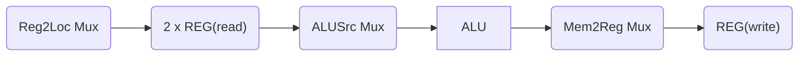

# Instructions
An example using the ARM ISA

> [!The datapaths shown below are examples given a single cycle datapath]
## Register Type 
All data values are located in registers  
Addressing Mode: __register addressing mode__

Rm: First source register
Rn: Second source register
Rd: Destination register
shamt: Shift amount for use in shift operations
### Datapath

## Data transfer type
Addressing Mode: __Base/Displacement addressing__

### Datapath
LDUR
1. Rn contains the information about WHERE the data in memory is
2. Offset Rn by address value  to get the memory address
3. Store the data from this memory address into Rt
STUR
1. Rn register contains the information about WHERE to store the data
2. Offset the information in Rn by the address value (22 + 64) = 90, to get the destination memory address
3. Store the data inside Rt into this offset value

> [!We can utilize a set of extra multiplexers to reuse components for both types]
> 

## Immediate type
Addressing mode: Immediate addressing

### Datapath

## Conditional Branch type
PC relative addressing mode

### Datapath

#### What's with the shift left by 2? #question 
Each instruction word is 32 bits (4 bytes) long. If we want to move by 2 instructions, we need to move 8 bytes. Thus, left shift by 2 to multiple the address by 4 to navigate the correct number of bytes.
## Unconditional Branch type
Addressing mode: PC relative addressing

## Combine all types into a single datapath

Critical path:

Notes:
- Reg2Loc (0) used to select Rm as a source register
- ALUSrc (0) to select register data rather than sign-extended address
- Mem2Reg (0) to select data from ALU rather than memory
### I-Type

Critical path: 

- Immediate address is zero extended and hence there is no delay here
### Load

Critical path: 

Notes:
- Reg2Loc not used as only 1 read
- ALUSrc (1) to select  sign-extended address
- Mem2Reg (1) to select data from memory
### Store

### Conditional Branch

Critical path:

Notes:
- Reg2Loc (1) to read Rt
- ALUSrc (0) to use data from register rather than address
- Zero-flag in AND-gate together with Branch-flag to select address to add for branching rather than default +4 to load into PC

Critical path:

Notes:
- Additional OR-gate to always select the address for branching
## Practice Problems

i. All instructions
ii. All instructions
iii. All except unconditional branch instructions
iv. ALU instructions, Load/Store instructions and Conditional Branch. _Why unconditional branch don't need?_
v. Load/Store instructions

PC++, PCin -> PCout and I-MEM is used for all datapaths
Propagation delay is the time delay for the signal to reach its destination.
Some signals are sent out in parallel (e.g. PC++) and the delay there is overshadowed by the overall delay by main logic.
i.
Reg2Loc Mux -> 2 x REG(read) -> ALUSrc Mux -> ALU -> Mem2Reg Mux -> REG(write)
2 Reg read signals are done in parallel.
$500+50+200+50+2000+50+200=3050ps$
ii.
REG(read) -> Zero Extend -> ALUSrc Mux -> ALU -> Mem2Reg Mux -> REG(write)
The delay from ALUSrcMux is overshadowed by the REG(R)
$500+200+2000+200+50=2950ps$
iii.
REG(read) -> ALUSrc Mux -> ALU -> D-MEM -> Mem2Reg Mux -> REG(write)
ALUSrc MUX delay is overshadowed by the delay in REG(read)

$500+200+2000+2000+50+200=4950$
iv.
STUR is LDUR but without the Mem2Reg Mux and REG write
$4950-200-50=4750ps$
v.
Reg2Loc Mux -> REG(read) -> ALUSrc Mux -> ALU -> BranchMUX -> PCin/out
$500+50+200+50+2000+50+100=2950$
vi.
Sign extend -> Shift -> Add -> BranchMUX -> PCin/out
$500+25+0+1500+50+100=2175$

i. 
Minimum clock period must allow types of instructions to complete without that clock period.
Hence the minimum clock period is the time needed to complete the longest instruction: 4950ps
ii.
Minimum clock period of a specific cycle must allow the longest stage to complete. Hence, the longest stage is EX or MA which has 2000ps.
