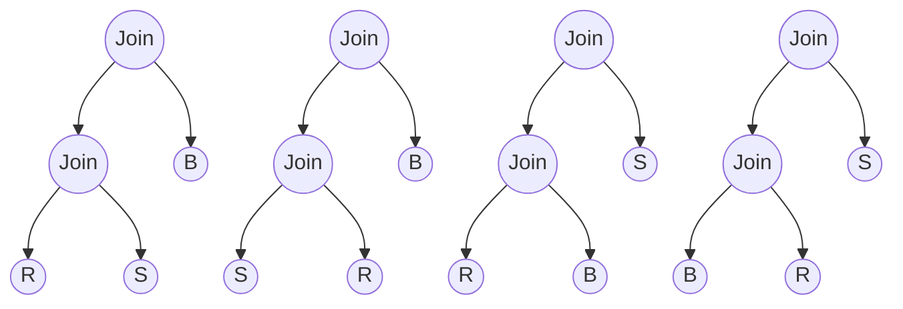
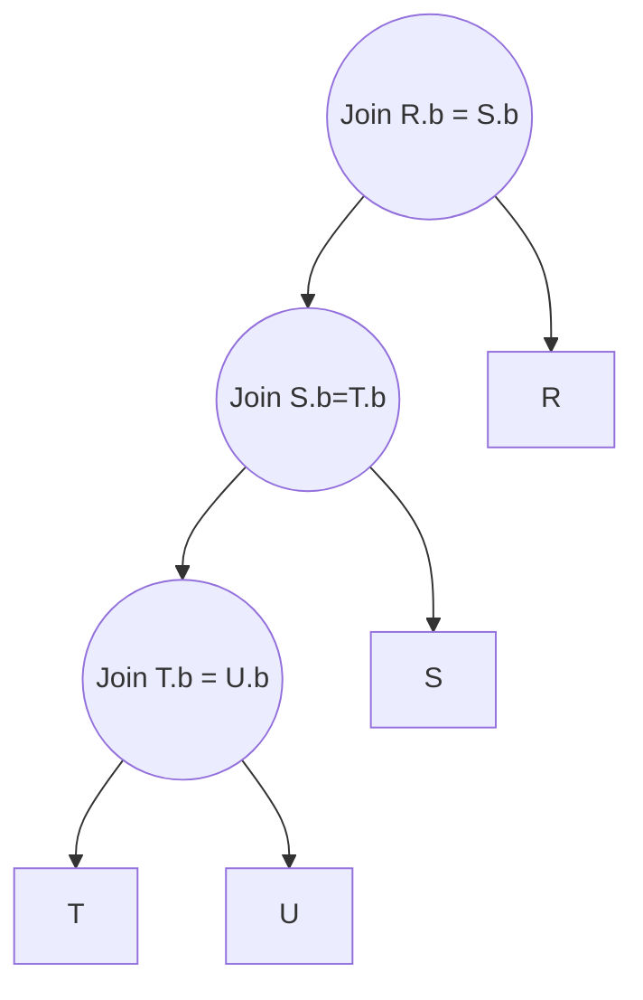

# Query Optimisation
## Algebraic Laws for Improving Query Plans
### Laws Involving Join

#### Converting Selection and Product to Joins

### Laws Involving Selection

If R is not a set (it is a bag which can contain duplicates) then the union operation will not eliminate duplicates correctly.
#### Pushing selection

### Projection Laws
Pushing projection is less useful than pushing selection. This is because projection keeps the number of tuples the same and only reduces the length of the tuples.
> [! Basic idea:] 
> can introduce a projection anywhere in an expression tree, as long as  it eliminates only attributes that are neither used by an operator above  nor are in the result of the entire expression.

## Logical Query Plan
Use of operator trees to represent the execution plan.

### Optimising the Operator Tree
We can use the algebraic laws to devise a more optimal logical query plan.

## Physical Query Plan
A physical query plan are the actions for which to execute the logical query plan.
It includes:
- Order and grouping of operations
- [[Notes/Query Processing|Algorithms for each operator]]
- [[Notes/Query Execution|Argument passing from operator to operator: pipelining vs materialisation]]
We need a way to make choices for each of these components.
### Cost estimation
The cost of a plan is the sum of the cost of each operator in the tree. However, to know the cost of an operator often requires the input sizes to be known. This is often not available for intermediary operators which are executed after other operators such as `SELECT` are done.
Assumptions:
1. Uniform distribution of values in domain
2. Independent distribution of values in different columns
3. Independence of predicates for select and join

#### Estimating Selection

3 is used as an intuition for how a range operation would usually return less than half of all the tuples.

For negation, we can estimate all tuples in the relation to satisfy the condition. Alternatively, notice that the number of distinct tuples that satisfy the relation is equal to $V(R,A)-1$

Notice that the equation relates to converting an OR relation into an equivalent AND notation. $A|B=!(!A \cap !B)$  

#### Estimating Joins
Assumptions:

- Containment of value: satisfied when Y is a key in S and the corresponding foreign key in R. Approximately true due to probability since if Y appears in S, it is likely to appear in R as well since S is large.
- Preservation: violated when there are tuples in R which join with no tuples in S.

#### Using Statistics
The assumption of uniform distribution is not accurate since real data is not uniformly distributed.
We can maintain a histogram for each relation to help us improve the estimation:

Statistics from each bucket can be used to determine the number of tuples in a range:

Example:

Example for join:

Sampling can be used to increase performance:

### Join Order Selection
Many  [[Notes/Two Pass Algorithms#Sort-Merge Join|join algorithms]] are asymmetric, the role played by the two argument relations are different and the cost depends on which relation plays which role. 
- Build relation: the relation stored in main memory
- Probe relation: relation which is read a block at a time to match the tuples in the build relation
*Assumptions: the left argument is the build relation and the right argument is the probe relation*
As the number of relations involved in the query increases, the number of possible join orders increases rapidly. We can use *join trees* to represent each of these possibilities:

#### Left-deep tree
It has a few advantages that make it a good default option:
- The number of possible left-deep trees with a given number of leaves is  large, but not nearly as large as the number of all trees. Thus, searches  for query plans can be used for larger queries if we limit the search to  left-deep trees. 
- Left-deep trees for joins interact well with common join algorithms —  nested-loop joins and one-pass joins in particular. 
- Intermediate results are not written to temporary files.
Example from the above image:
*Left-deep tree*:
1. Right children are the probe relations, we start building the join from the left leaf node R3
2. We keep R3 in main memory and perform R3 $\Join$ R1. This uses B(R) + B($R3\Join R1$) buffers
3. No need to keep R3 in main memory anymore, can use the space to store the result from B($R3\Join R1\Join R5$).
*Right-deep tree*:
1. R3 is the build relation from the root, load R3 into memory
2. Need $R3\Join R1\Join R5\Join R2\Join R4$ as the probe relation. To compute this, we need R1 to be loaded into main memory to compute $R1\Join R5\Join R2\Join R4$ as the probe relation.
3. So on and so forth...
The right-deep tree will require alot more space for the intermediate relations.
### Join Algorithm Selection
#### Heuristics

#### Dynamic Programming
Since we are concerned about minimising the cost of the query plan, we can utilise [[003 Dynamic Programming|DP]] to remember the costs at each intermediate step for each enumeration. **The cost is the size of the intermediate relation.**
Example:

The cost for 2 relations is still 0, as no intermediate results are generated:

There are $4\choose{3}$ ways to select 3 out of 4 of the relations. If we only consider left-deep trees, each option has $3\choose2$ permutations. We use the cost of the double relations to find the min cost of each permutation.

Finally, when we consider all 4 relations, there are only 4 permutations if we only select left-deep trees. That is $4\choose2$$\times$ $2\choose1$. The first 4 rows represent these options:

## Practice Problems

$$
\begin{aligned}
T(R\Join S)&=T(R)\times T(S)/max(V(R,a),V(S,a))
\\T(R_1\Join R_2\Join R_3) &=T(T(R_1\Join R_2)\Join R_3)
\\&=(1000\times1500/1100)\times750/100
\\&=10227.27
\end{aligned}
$$

$$
\begin{align}
\text{Size of Y}=20\times128&=2560B
\\B(Y) &=5
\\ \text{Size of X}&=60\times64=3840B
\\B(X)&=7.5=8
\\\text{Nested loop join}&=5+(5/5-1)\times8=15
\\\text{Joined tuple size}&=128+64=192
\\\text{T(T)}&=20\text{(because b is key in X,there can be at most 20 matching values)}
\\\text{Write B(T) to disk: }&20/(512//192)=10
\\\text{Read B(T) for selection}=&10
\\\text{Block access for selection}&=0.5\times10=5
\\\text{Total Disk Access}&=15+10+10+5=40
\end{align}
$$

a.
1. Select movie with year > 1990 and rating = 10
2. Join Movie and Studio
b.
$$\begin{align}
P(Year>1990)=1/3,P(Rating=10)=1/10
\\\text{Size after Select Movie}=\frac{1}{10\times3}\times 24000=800
\\\text{Size after Join}=T(M)\times T(S)/max(V(M,name),V(S,name))
\\=800\times1000/800=1000
\end{align}
$$

i. $6000/20=300$
ii. Tuples in $\sigma_{c>25}(S)=6000/3=2000$
Tuples in $R\Join \sigma_{c>25}(S)=10000\times2000/200=100000$
iii.
Number of tuples of S which satisfy the condition: $\frac{2}{100}\times6000=120$
These tuples will fit at best in $120/4=30$ blocks
At worst, each key will take up additional 1 tuple block: $30+1+1=32$
Number of block access to find the 2 keys: $2\times3=6$
Total I/O: $32+6=38$
iv.
1. Use $101-1=100$ buffers to repeatedly load blocks of R.
2. Join every block of S with these 100 blocks of R
3. Repeat until all blocks of R are loaded
Cost: $1000+1500\times(1000/100)=16000$

Left deep plans:
$(Emp \Join_{Dno}Dept)\Join_{Job}Job$ 
$(Dept \Join_{Dno}Job)\Join_{Job}Job$ 
$(Emp \Join_{Job}Job)\Join_{Dno}Dept$ 
$(Job \Join_{Job}Emp)\Join_{Dno}Dept$ 

i. The join order for a set of relations can be built with the sub problem of the set of relations -1. Can use DP to store the information of the minimal cost of each set of relations.
ii.
| Relation | {A,B}                     | {A,C} | {A,D} | {B,C}                   | {B,D}                   | {C,D}                   |
| -------- | ------------------------- | ----- | ----- | ----------------------- | ----------------------- | ----------------------- |
| Size     | $1500\times1000/50=30000$ | -     | -     | $1000\times2000/50=40000$ | $1000\times1000/50=20000$ | $2000\times1000/50=40000$ |

| Relation | {A,B,C}                        | {A,B,D}                      | {B,C,D}                      |
| -------- | ------------------------------ | ---------------------------- | ---------------------------- |
| Size     | $30000\times2000/50=1,200,000$ | $30000\times1000/50=600,000$ | $40000\times1000/50=800,000$ |
| Min Cost | (BC)A: 40000                   | (BD)A:20000                  | (BC)D                             |

| Relation | {A,B,C,D}                      |
| -------- | ------------------------------ |
| Size     | $1,200,000\times1000/50=24,000,000$ |
| Min Cost | (ABD)C: 600,000                   |

Final order: $((B\Join D)\Join A)\Join C$

i.
Selectivity on condition a: $B(R)/V(R,a)=1000/20=50$
Selectivity on condition b: $T(R)/V(R,b)=5000/1000=5$
Selectivity on condition c = 3: $T(R)/V(R,c)=5000/5000=1$
Best query plan: select on condition c=3 -> b=2 -> a = 1
Expected disk i/o : 1
ii.
Selectivity on condition c < 3: $T(R)/3=5000/3=1666$
Best query plan: select on condition b=2 -> a=1 -> c < 3
Expected disk i/o : 5

i.
$$\begin{aligned}
S\Join_{sid} R&=T(S)\times T(R)/max(V(S,sid),V(R,sid))
\\&=1000\times10000/1000=10,000
\\(S\Join_{sid}R)\Join_{bid}B&=10000\times100/100=10000
\\\sigma_{size>5 \& \ day=''}&=10000/(3\times500)=6.66
\end{aligned}$$
ii.

iii.
For {R,S}:
Hash join: $3(B_R+B_S)=3(250+50)=900$
Sort merge join: $3(B_R+B_S)=3(250+50)=900$
Block based NL join:
R outer loop = $B_R+B_S\times B_R/(M-1)=250+50\times250/(50-1)=506$
S outer loop = $B_S+B_R\times B_S/(M-1)=50+250\times50/(50-1)=306$

Blocked based NL join would work best

$$
\begin{aligned}
IO(\sigma_{scity=Seattle})&=100
\\B(\sigma_{scity=Seattle})&=100/20=5
\\T(\sigma_{scity=Seattle})&=5\times20=100
\\IO(\sigma_{srank<10})&=10
\\B(\sigma_{srank<10})&=10/3=3.33\approx4
\\T(\sigma_{srank<10})&=10/3=100/3\approx34
\\&\text{Sort-merge join in-memory:}
\\IO\Join_{sid=sid}&=0 \ \text{(inputs are in memory)}
\\T(\Join_{sid=sid})&=100\times34/100=34
\\&\text{We can ignore the cost of the index lookup}
\\&\text{But we still need to access data pages for Major}
\\&\text{We assume each input tuple needs 1 Major page}
\\IO\Join_{id=id}&=34
\\\text{Total Cost}&=100+10+34=144
\end{aligned}
$$

i. $100/(3\times10)=3.33\approx4$
ii. 
$P(b!=25)=9/10$
$P(d!=13)=49/50$
$100\times(1-\frac{9}{10}\times\frac{49}{50})=11.8\approx12$
iii.
$100\times500\times(\frac{1}{50}\times\frac{1}{100})=10$

i. 
$(10\times30)+(40\times100)+(100\times200)/30=810$
ii.
$300\times600\times\frac{1}{30}=6000$

$$
\begin{align}
&T(Student)=10,000
\\&IO(Student)=1000
\\&T(Checkout)=300,000
\\&IO(Checkout)=15,000
\\&T(\text{Nested Loop})=10,000\times300,000/10,000=300,000
\\&IO(\text{Nested Loop})=1000+1000\times15000=15,001,000
\\&T(Book)=50,000
\\&IO(Book)=5000
\\&T(\text{Tupled Based})=50000\times300,000/50,000=300,000
\\&IO(\text{Tupled based})=0 \text{ (inputs are in memory)}
\\&T(\sigma)=\frac{300,000}{500}\times\frac{20-12-1}{24-7}\approx234
\end{align}
$$

